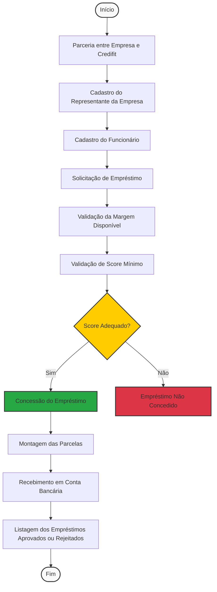

Abaixo segue diagrama de fluxo

```mermaid
graph TD
    %% Início e Fim do Diagrama
    A([Início]) --> B[Parceria entre Empresa e Credifit]
    K --> L([Fim])

    %% Processo de Solicitação de Empréstimo
    B --> C[Cadastro do Representante da Empresa]
    C --> D[Cadastro do Funcionário]
    D --> E[Solicitação de Empréstimo]
    E --> F[Validação da Margem Disponível]
    F --> G[Validação de Score Mínimo]
    G --> H{Score Adequado?}
    H -- Sim --> I[Concessão do Empréstimo]
    H -- Não --> J[Empréstimo Não Concedido]
    I --> M[Montagem das Parcelas]
    M --> N[Recebimento em Conta Bancária]
    N --> K[Listagem dos Empréstimos Aprovados ou Rejeitados]

    %% Classes para Elementos
    classDef success fill:#28a745,stroke:#333,stroke-width:2px;
    classDef failure fill:#dc3545,stroke:#333,stroke-width:2px;
    classDef decision fill:#ffcc00,stroke:#333,stroke-width:2px;
    classDef startend fill:#f9f9f9,stroke:#333,stroke-width:2px;

    %% Aplicando Classes
    A:::startend
    L:::startend
    H:::decision
    I:::success
    J:::failure

```